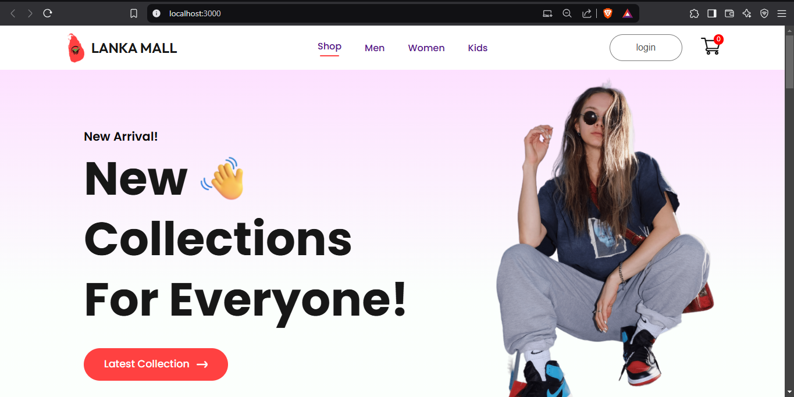
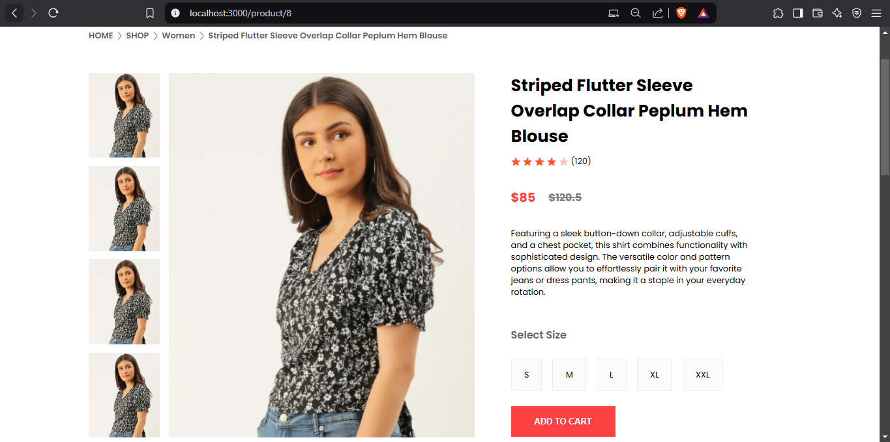
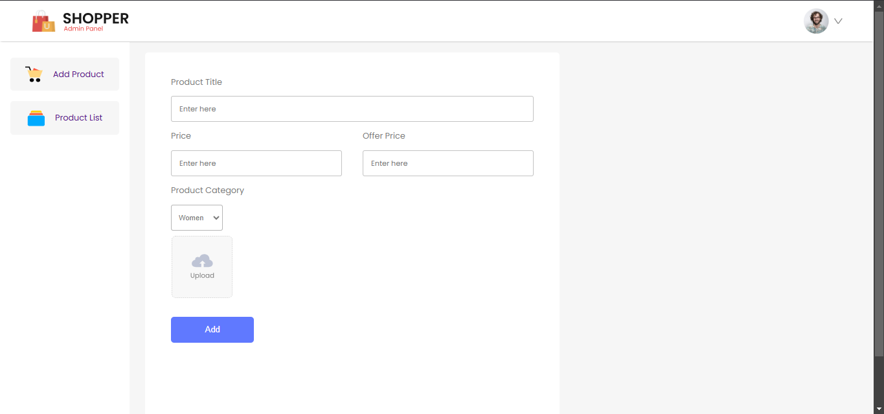
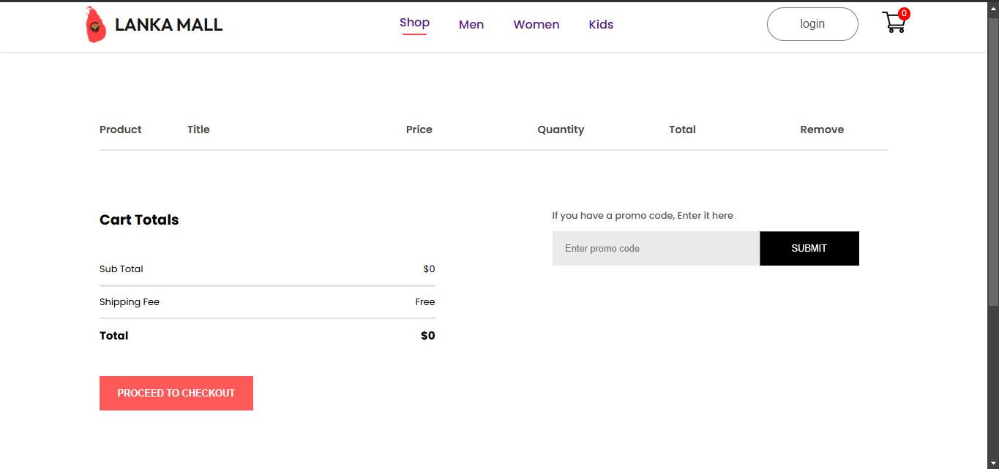

# 🛍️ My E-Commerce Website

Welcome to **My E-Commerce Website**! This is a fully responsive online shopping platform built using **React.js**.

## 🚀 Features
- 🔥 Modern and responsive UI
- 🛒 Add to cart functionality
- 📦 Category-based product filtering
- 🌍 Fully responsive design for mobile and desktop
- 💳 Checkout page (optional backend integration)
- 🌐 Dynamic product details pages

## 📸 Screenshots

- 🔥 Home Page


- 🛒 Product Page


- 📦 Admin Page


- 💳 Cart Page


## 🛠️ Technologies Used
- **Frontend:** React.js, CSS, JavaScript
- **State Management:** Context API
- **Routing:** React Router
- **Icons & UI:** FontAwesome, Material UI

## 🔧 Installation & Setup
To run this project locally, follow these steps:

### 1️⃣ Clone the repository:
```bash
git clone https://github.com/yourusername/my-ecommerce-site.git
```


### 2️⃣ Navigate into the project folder:
```bash
cd my-ecommerce-site
```
### 3️⃣ Install dependencies:
```bash
npm install
```

4️⃣ Start the development server:
```bash
npm start
```
This will start the app at http://localhost:3000/.

🎯 Future Improvements </br>
🔗 Backend API integration for real products </br>
🏦 Payment gateway integration </br>
📊 Order tracking system </br>

💌 Contact </br>
For any questions or feedback, feel free to reach out: </br>

📧 Email: afthal6958@gmail.com
🔗 GitHub: https://github.com/afthal-ahamad01

